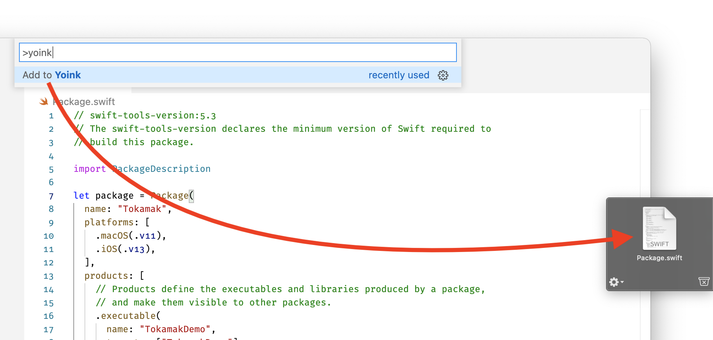

# Yoink for VS Code

This extension adds an “Add to Yoink” action to the context menu of the file tree and to the command palette when in an editor.

This extension is not affilliated with Yoink, Eternal Storms, or Matthias Gansrigler.

## Features

- “Add to Yoink” action in Command Palette
- “Add to Yoink” item in the Explorer’s context menus

Note: these actions are only available for local files. It wouldn’t make sense to add remote files to Yoink!

## Requirements

You have to have [Yoink for Mac](https://eternalstorms.at/yoink/mac/) installed and running. You can use the free trial, purchase it [through the Mac App Store](https://itunes.apple.com/app/yoink/id457622435?mt=12&at=1001l8pT&ct=website), or get it as part of [the Setapp subscription app service](https://go.setapp.com/invite/p5y3tgyl).

## Known Issues

If Yoink is not running, the first time you run “Add to Yoink” will only launch Yoink, and won’t add the file to Yoink.

## Release Notes

<!-- changelog-start -->

### 1.0.0

- Initial release

<!-- changelog-end -->

<!--
## Following extension guidelines

Ensure that you've read through the extensions guidelines and follow the best practices for creating your extension.

- [Extension Guidelines](https://code.visualstudio.com/api/references/extension-guidelines)

## Working with Markdown

**Note:** You can author your README using Visual Studio Code. Here are some useful editor keyboard shortcuts:

- Split the editor (`Cmd+\` on macOS or `Ctrl+\` on Windows and Linux)
- Toggle preview (`Shift+CMD+V` on macOS or `Shift+Ctrl+V` on Windows and Linux)
- Press `Ctrl+Space` (Windows, Linux) or `Cmd+Space` (macOS) to see a list of Markdown snippets

### For more information

- [Visual Studio Code's Markdown Support](http://code.visualstudio.com/docs/languages/markdown)
- [Markdown Syntax Reference](https://help.github.com/articles/markdown-basics/)

**Enjoy!**
-->
